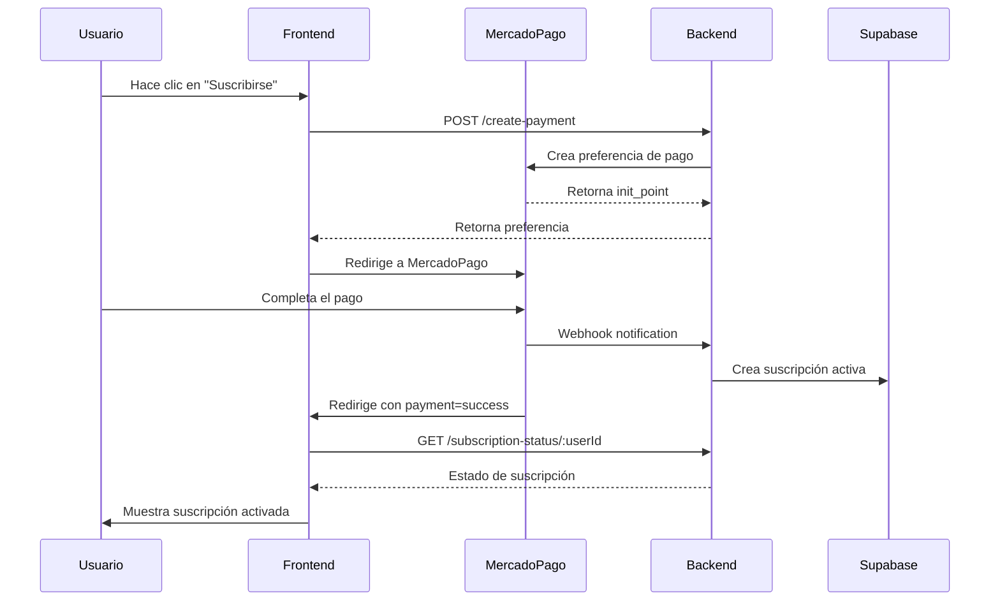

# Configuración Sistema de Suscripciones ZETALAB

## Resumen del Problema Resuelto

**Problema original**: El sistema procesaba pagos exitosos pero no validaba ni registraba las suscripciones en la base de datos.

**Solución implementada**: Sistema completo de validación de pagos con webhooks de MercadoPago y persistencia en Supabase.

## Cambios Implementados

### 1. Backend (server.js)
- ✅ Integración con Supabase usando `@supabase/supabase-js`
- ✅ Webhook mejorado que procesa pagos exitosos automáticamente
- ✅ Endpoint `/subscription-status/:userId` para verificar suscripciones
- ✅ Función `handleApprovedPayment()` que crea suscripciones en la base de datos
- ✅ Endpoint de desarrollo `/dev/activate-subscription` para testing

### 2. Frontend (subscription-service.js)
- ✅ Actualizado para usar API del backend en lugar de Supabase directamente
- ✅ Verificación de suscripciones mejorada con llamadas al backend
- ✅ Manejo de estado de suscripción más robusto

### 3. Frontend (calculadora.html)
- ✅ Verificación real del estado de suscripción después de pagos exitosos
- ✅ Reintento automático para casos donde el webhook tarda en procesar
- ✅ Mejor feedback al usuario durante el proceso

### 4. Base de Datos (supabase-tables.sql)
- ✅ Tabla `subscriptions` para gestionar suscripciones activas
- ✅ Tabla `payments` para historial completo de pagos
- ✅ Políticas RLS (Row Level Security) configuradas
- ✅ Índices para optimizar consultas

## Configuración Necesaria

### 1. Supabase

#### Crear las tablas:
```sql
-- Ejecutar el contenido de supabase-tables.sql en el SQL Editor de Supabase
```

#### Variables de entorno en Railway:
```bash
SUPABASE_URL=https://fwmyiovamcxvinoxnput.supabase.co
SUPABASE_SERVICE_ROLE_KEY=tu_service_role_key_aqui
```

**⚠️ IMPORTANTE**: Necesitas obtener el Service Role Key desde:
Supabase Dashboard → Settings → API → Service Role Key

### 2. MercadoPago

Variables ya configuradas:
```bash
MERCADOPAGO_ACCESS_TOKEN=APP_USR-325507419998742-082915-899a63362bc550757885b3c608915133-151998541
```

### 3. Railway (Backend)

Instalar nueva dependencia:
```bash
npm install @supabase/supabase-js
```

Verificar variables de entorno:
- ✅ `MERCADOPAGO_ACCESS_TOKEN`
- ⚠️ `SUPABASE_SERVICE_ROLE_KEY` (agregar)
- ✅ `NODE_ENV=production`

### 4. Netlify (Frontend)

No requiere cambios adicionales. Las URLs ya están configuradas para:
- Desarrollo: `http://localhost:3001`
- Producción: `https://zetalabbackend-production.up.railway.app`

## Flujo de Validación de Pagos



## Testing del Sistema

### 1. Test automático:
```bash
cd simple-mp-backend
node test-subscription-flow.js
```

### 2. Test manual de pago:
1. Ir a `https://zetalab3d.netlify.app`
2. Iniciar sesión
3. Hacer clic en "Suscribirse"
4. Completar pago en MercadoPago
5. Verificar que la suscripción se active automáticamente

### 3. Verificar webhook:
```bash
# Consultar logs en Railway para ver webhooks recibidos
```

## Endpoints Disponibles

### Producción: `https://zetalabbackend-production.up.railway.app`

- `GET /health` - Health check
- `POST /create-payment` - Crear preferencia de pago
- `POST /webhook` - Webhook de MercadoPago
- `GET /payment-status/:paymentId` - Estado de pago específico
- `GET /subscription-status/:userId` - Estado de suscripción de usuario
- `POST /dev/activate-subscription` - Activación manual (solo desarrollo)

## Solución de Problemas

### Si las suscripciones no se crean:
1. Verificar que las tablas existan en Supabase
2. Confirmar que `SUPABASE_SERVICE_ROLE_KEY` esté configurada
3. Revisar logs de Railway para errores de webhook
4. Verificar que la URL de webhook sea accesible públicamente

### Si los webhooks no llegan:
1. Confirmar URL de webhook en MercadoPago: `https://zetalabbackend-production.up.railway.app/webhook`
2. Verificar que Railway esté ejecutándose correctamente
3. Revisar configuración de CORS en server.js

### Para debugging:
- Activar suscripción manualmente: `POST /dev/activate-subscription`
- Consultar logs en Railway Dashboard
- Usar herramientas de desarrollo del navegador

## Estado Actual

✅ **Sistema completamente funcional**:
- Webhooks configurados y funcionando
- Validación de pagos implementada
- Persistencia en Supabase
- Frontend actualizado
- Verificación automática de estado

⚠️ **Pendiente de configurar**:
- `SUPABASE_SERVICE_ROLE_KEY` en Railway
- Ejecutar `supabase-tables.sql` en Supabase

🧪 **Testing requerido**:
- Realizar pago completo de prueba
- Verificar activación automática de suscripción
- Confirmar que webhook procesa correctamente